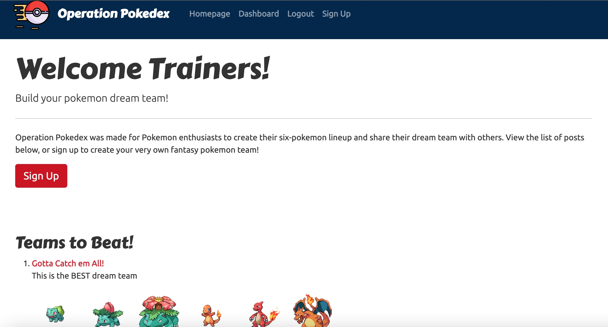

[] 
# <h1 align="center">Pokemon Dream Team Builder</h1>

## Description
A blog-style CMS that allows users to create their pokemon dream teams and interact with other users.

## Application

Link to deployed Heroku application: 

Screenshot of application:  

  
## Table of Contents
  - [Description](#description)
  - [Application](#application)
  - [Installation](#installation)
  - [Usage](#usage)
  - [License](#license)
  - [Contributors](#contributors)
  - [Tests](#tests)
  - [Questions](#questions)

## Installation
Clone this repository and connect to your own Database via sequelize. 

## Usage
Build your Pokemon Dream Team and share them with other users! Interact with other users by commenting on their posts and  comparing your dream teams!

## License
[]This application is covered under the MIT license. (https://opensource.org/licenses/MIT)

## Contributors
<a href="https://www.npmjs.com/package/bcrypt">bcrypt node package</a>  
<a href="https://getbootstrap.com/">Bootstrap</a>  
<a href="https://sequelize.org/">Sequelize</a>  
<a href="https://expressjs.com/">Express</a>  
<a href="https://handlebarsjs.com/">Handlebars</a>  
<a href="https://github.com/sidorares/node-mysql2">mysql2</a>  
<a href="https://pokeapi.co/">PokeAPI.co</a>  
<a href="https://www.heroku.com">Heroku</a>  
<a href="https://www.jawsdb.com/">jawsDB</a>  
<a href="https://www.flaticon.com/free-icons/pokemon" title="pokemon icons">Pokemon icons created by Nikita Golubev - Flaticon</a>  
<a href="https://www.flaticon.com/free-icons/pokemon" title="pokemon icons">Pokemon icons created by Smashicons - Flaticon</a>  
<a href="https://www.flaticon.com/free-icons/pokemon" title="pokemon icons">Pokemon icons created by Darius Dan - Flaticon</a>  
<a href="https://www.flaticon.com/free-icons/pokemon" title="pokemon icons">Pokemon icons created by Freepik - Flaticon</a>  
## Tests
N/A

## Questions? Contact Us:
GitHub: https://github.com/ejackson1228/  
Email: ejackson1228@gmail.com

GitHub: https://github.com/charliec1665/  
Email: charliec1665@gmail.com

GitHub: https://github.com/zasen01/  
Email: zse0296@gmail.com

GitHub: https://github.com/n-roz/  
Email: naomiroznik@gmail.com

